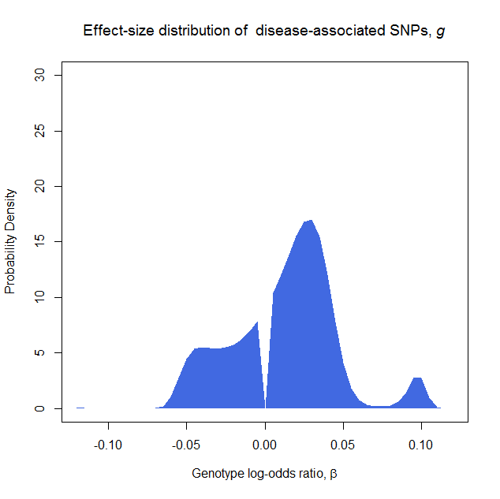

# SP-HMM;
### Semi-Parametric Hierarchical Mixture Model for estimating polygenic disease architectures using GWAS summary data

The SP-HMM, implemented in R, estimates the proportion of disease-associated variants, <i>&pi;</i>, and their effect-size distribution, <i>g</i>, via an EM algorithm. The non-parametric estimation for <i>g</i> could flexibly capture various forms of the underlying effect-size distributions. Under the estimated architecture, we can also estimate the liability-scale variance explained by SNPs, <i>V</i>, and the posterior means of effect sizes of individual SNPs.

## Starting with running the SP-HMM analysis

Make sure that ‘doSNOW’ package for parallel processing is installed.
Load the package.

```R
library("doSNOW")
```

Set the working directory to the directory containing ‘SP-HMM.R’ (implementing the SPHMM analysis) and ‘testdt.csv’ files (an artificial GWAS summary data with 100,000 SNPs), then read the functions and the test data.

```R
source("SP-HMM.R")
testdt <- read.csv("testd.csv")
head(testdt)
            y          v_y         p
1 -0.01710068 0.0005182277 0.2575904
2 -0.04851392 0.0004130463 0.4223130
3 -0.06080565 0.0004473759 0.6652924
4 -0.04468977 0.0004027445 0.5082014
5 -0.02915923 0.0004257426 0.6265296
6 -0.07183396 0.0004131936 0.5792656
```

The variables in 'testdt' are as follows:

Variable |Description
--------|-------------------------------------------------------------------------------------------------
y       |Estimates of genotype log-odds ratios for 100,000 SNPs. Here, the genotypes <i>AA</i>, <i>Aa</i>, and <i>aa</i> in each bi-allelic SNP have dosages 0, 1, and 2, respectively. The assignment of the genotype <i>a</i> is arbitrary. For example, <i>a</i> is the derived allele and <i>A</i> is the ancestral one, or, <i>a</i> is the minor and <i>A</i> is the major one.
v\_y    |Empirical variances of y.
p |Allele frequencies of <i>a</i>.


Conduct SP-HMM analysis using the function ‘hmm_em_aut’, with 2,000 EM iterations and without bootstrap standard errors. The disease prevalence, required for estimating <i>V</i>, is assumed to be 1%.

```R
rslt <- hmm_em_aut(y=testdt$y,v_y=testdt$v_y,emitr=2000,prev=0.01,p=testdt$p,nbs=0)
```

Show the estimated proportion of disease-associated SNPs.

```R
rslt$pi
```

Plot the estimated effect-size distribution.
```R
# Set labels
main=expression(paste("Effect-size distribution of  disease-associated SNPs, ", italic(g), sep=""))
ylab="Probability Density"
xlab=expression(paste("Genotype log-odds ratio, ",beta,sep=""))

# Add zero point and rescale mass point probabilities (p_b) for plotting "probability density"
a2 <- append(rslt$a, 0, after=length(rslt$a)/2)
p_b2 <- append(rslt$p_b, 0, after=length(rslt$a)/2)
p_b2 <- p_b2/sum(p_b2*(a2[2]-a2[1]))

# Plot
plot(a2, p_b2, xlim=c(-0.12,0.12), ylim=c(0,30), col=0, xlab=xlab, ylab=ylab, main=main);
polygon(a2, p_b2, col="royalblue", border=NA)
```
<!--

-->


Show the estimated liability-scale variance explained by the SNP set.

```R
rslt$herit
```

Show the posterior means of effect sizes for the SNP set.
```R
head(rslt$pm)
```


## Function: hmm_em
The function conducts SP-HMM analysis for a given SNP set with user-specified initial values, init_pi and init_p_b, in the EM algorithm.

Argument |Description
--------|-------------------------------------------------------------------------------------------------
y       |Vector of estimated genotype log odds ratios, <b><i>&beta;</i></b>^, for the SNP set. A value must be given. Here, the genotypes <i>AA</i>, <i>Aa</i>, and <i>aa</i> in each bi-allelic SNP have dosages 0, 1, and 2, respectively. The assignment of the genotype <i>a</i> is arbitrary. For example, <i>a</i> is the derived allele and <i>A</i> is the ancestral one, or, <i>a</i> is the minor and <i>A</i> is the major one.
v\_y    |Vector of empirical variances of estimated genotype log odds ratios, Var[ <b><i>&beta;</i></b>^ ]. A value must be given.
init_pi |Initial value of the proportion of disease-associated SNPs, <i>&pi;</i>, in the EM algorithm. A value must be given.
a       |Series of nonzero points <i><b>b</b></i> = (<i>b<sub>1</sub>, b<sub>2</sub>, ..., b<sub>B</sub></i>), at which the non-parametric estimate of <i>g</i> was supported. Default = c(seq(-0.3,-0.005,by=0.005),seq(0.005,0.3,by=0.005)).
init_p_b|Initial values of the discrete mass point probabilities, <i><b>p</b></i> = (<i>p<sub>1</sub>, p<sub>2</sub>, ..., p<sub>B</sub></i>), at <i><b>b</b></i> = (<i>b<sub>1</sub>, b<sub>2</sub>, ..., b<sub>B</sub></i>) in the EM algorithm. A value must be given.
emitr|Number of EM iteration. A value must be given.
prev|The disease prevalence, required for estimating <i>V</i>. Default = NA.
p|Vector of allele frequencies for the SNP set, required for estimating <i>V</i>. Default = NA.
brk|If brk = 1, the EM algorithm is stopped when the relative change of <i>&pi;</i> in one EM iteration is small (< 0.005 %). Default = 0.


Value|Description
------|----------------------------------------------------------------------------------------------------
pi    |Estimated proportion of disease-associated SNPs, <i>&pi;</i>^
a     |Series of nonzero points <i><b>b</b></i> = (<i>b<sub>1</sub>, b<sub>2</sub>, ..., b<sub>B</sub></i>). The same as ‘a’ in the Arguments.
p_b   |Estimated mass point probabilities, <i><b>p</b></i>^ = (<i>p<sub>1</sub>^, p<sub>2</sub>^, ..., p<sub>B</sub>^</i>).
herit |Estimated variance explained by the SNP set, <i>V</i>^.
pm    |Vector of posterior means of effect-sizes for the SNP set.

## Function: hmm_em_aut
The function conducts SP-HMM analysis for a given SNP set with automatically determined initial values in the final (main) EM algorithm. The initial values are determined by a two-stage approach. Setting <i>g</i> to be uniformly distributed (i.e., <i>p<sub>i</sub> = 1/B </i> for all <i>i</i> ), the EM procedures with the initial values, <i>&pi;</i> = 0.1, 0.2, ..., or 0.9, are ran and the obtained <i>&pi;</i> with maximum likelihood is selected as pi_init. Then setting <i>g</i> to be uniformly distributed again, we get g_init by the EM procedure with fixed <i>&pi;</i> = pi_init (the EM iterations are stopped when the relative change of <i>&pi;</i> in one iteration is small,< 0.005 % or until 200 iterations). The hmm_em_aut function conducts the final (main) EM algorithm using the initials, pi_init and g_init. The function also produces the parametric bootstrap standard errors for the estimates of <i>&pi;</i> and <i>V</i>.

The following arguments are used in the stage for determining initials, pi_init and g_init;

Argument |Description
--------|-------------------------------------------------------------------------------------------------
init_pi |Initial <i>&pi;</i> values used in the stage for determining pi_init. Default = seq(0.1,0.9,by=0.1).
a0      |Series of nonzero points <i><b>b</b></i> = (<i>b<sub>1</sub>, b<sub>2</sub>, ..., b<sub>B</sub></i>) in the stage for determining pi_init. Default = c(seq(-0.3,-0.02,by=0.02),seq(0.02,0.3,by=0.02)).
emitr00 |Number of EM iteration in the stage for determining pi_init. Default = 200.
emitr01 |Number of maximum EM iteration in the stage for determining g_init. Default = 200.

The following arguments are used in the final (main) EM algorithm;

Argument |Description
--------|-------------------------------------------------------------------------------------------------
y       |Vector of estimated genotype log odds ratios, <b><i>&beta;</i></b>^, for the SNP set. A value must be given. Here, the genotypes <i>AA</i>, <i>Aa</i>, and <i>aa</i> in each bi-allelic SNP have dosages 0, 1, and 2, respectively. The assignment of the genotype <i>a</i> is arbitrary. For example, <i>a</i> is the derived allele and <i>A</i> is the ancestral one, or, <i>a</i> is the minor and <i>A</i> is the major one.
v_y     |Vector of empirical variances of estimated genotype log odds ratios, Var[ <b><i>&beta;</i></b>^ ].A value must be given.
emitr   |Number of EM iteration. Default = 2,000.
a       |Series of nonzero points <i><b>b</b></i> = (<i>b<sub>1</sub>, b<sub>2</sub>, ..., b<sub>B</sub></i>), at which the non-parametric estimate of <i>g</i> was supported. Default = c(seq(-0.3,-0.005,by=0.005),seq(0.005,0.3,by=0.005)).
prev    |The disease prevalence, required for estimating <i>V</i>. Default = NA.
p       |Vector of allele frequencies for the SNP set, required for estimating <i>V</i>. Default = NA.    
brk|If brk = 1, the EM algorithm is stopped when the relative change of <i>&pi;</i> in one EM iteration is small (< 0.005 %). Default = 0.
nbs     |The number of bootstrap samples. If nbs = 0, the bootstrapping procedure is not conducted. Default = 0.


Value|Description
------|----------------------------------------------------------------------------------------------------
pi    |Estimated proportion of disease-associated SNPs, <i>&pi;</i>^
a     |Series of nonzero points <i><b>b</b></i> = (<i>b<sub>1</sub>, b<sub>2</sub>, ..., b<sub>B</sub></i>). The same as ‘a’ in the Arguments.
p_b   |Estimated mass point probabilities, <i><b>p</b></i>^ = (<i>p<sub>1</sub>^, p<sub>2</sub>^, ..., p<sub>B</sub>^</i>).
herit |Estimated variance explained by the SNP set, <i>V</i>^.
pm    |Vector of posterior means of effect-sizes for the SNP set.
bs_pi |Bootstrap samples of <i>&pi;</i>^.
bs_herit|Bootstrap samples of the variance explained by the SNP set, <i>V</i>^.
